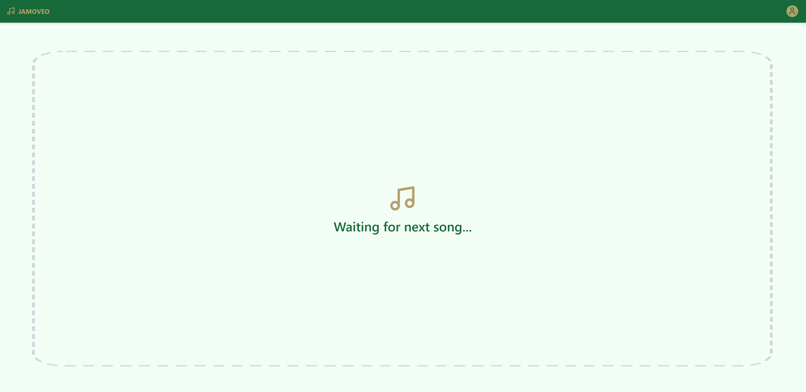
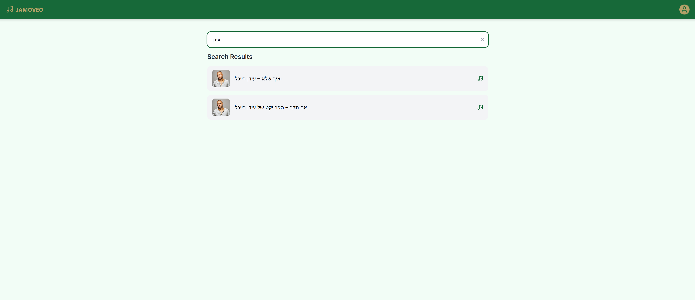
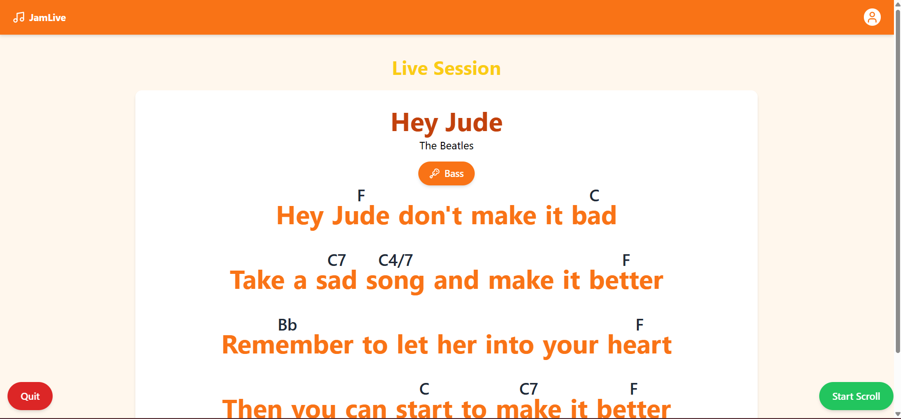

# 🎸 JaMoveo – Real-Time Rehearsal Web App

JaMoveo is a full-stack web application that enables musicians to join live rehearsal sessions directly from their mobile phones. Users register with their instrument, and an admin leads the session by selecting a song. Lyrics and chords are displayed in real time, with role-based views and synchronized scrolling.

## 🌐 Live Demo

- **Frontend**: [https://jamoveo-macabi.vercel.app](https://jamoveo-macabi.vercel.app)
- **Backend**: [https://jamoveo-server.up.railway.app](https://jamoveo-server.up.railway.app)

## 🚪 Signup Routes

| Role  | Path              | Notes                      |
| ----- | ----------------- | -------------------------- |
| Admin | `/register-admin` | Registers a new admin user |
| User  | `/register`       | Registers a regular user   |

## 👤 Test Users

| Role  | Username | Password |
| ----- | -------- | -------- |
| Admin | `admin`  | `admin`  |
| User  | `user`   | `user`   |

## 🧠 Features

- **Authentication**: Signup & login with role-based redirection.
- **Live Song Session**:
  - Admin selects a song → triggers session start.
  - Users are redirected to the live song view.
  - Chords + lyrics for Users, lyrics only for singers.
- **Auto Scroll**: Users can toggle smooth scrolling of lyrics.
- **Socket.io**: Real-time sync between admin and connected users.
- **Accessibility**: Large fonts, high contrast for smoky environments.
- **Responsive**: Mobile-first design with smooth UI via Tailwind.

## 🧪 Tech Stack

| Layer    | Tech                    |
| -------- | ----------------------- |
| Frontend | React + TypeScript      |
| Styling  | TailwindCSS             |
| State    | Redux Toolkit + Persist |
| Backend  | NestJS + Socket.io      |
| DB       | MongoDB (via Mongoose)  |
| Auth     | JWT                     |
| Hosting  | Vercel + Railway        |

## 🛠️ Local Setup

1. **Clone the repository**

```bash
git clone https://github.com/your-username/JaMoveo.git
cd JaMoveo
```

2. **Frontend setup**

```bash
cd client
npm install
npm run dev
```

3. **Backend setup**

```bash
cd server
npm install
npm run start:dev
```

## 4. **Environment Variables**

You need to configure two `.env` files — one for the **frontend** and one for the **backend**:

### ✅ Frontend (`frontend/.env`)

```env
REACT_APP_BASE_URL=http://localhost:8000
REACT_APP_SOCKET_URL=http://localhost:8000
```

This sets the base URL for API requests during development.

---

### ✅ Backend (`backend/.env`)

```env
PORT=8000
MONGO_URI=<your MongoDB connection string>
JWT_SECRET=<your JWT secret>
JWT_EXPIRES_IN=90d
JWT_COOKIE_EXPIRES_IN=90
FRONTEND_ORIGIN=http://localhost:3000
```

- `MONGO_URI`: Connection string to your MongoDB instance (Atlas or local)
- `JWT_SECRET`: A secure string used to sign JWT tokens
- `CLIENT_URL`: The URL of your frontend app (used for CORS)

> 💡 **Note**: The deployed demo version already connects to a live backend.  
> If you'd like to run the backend locally, you'll need to provide your own `MONGO_URI` and `JWT_SECRET`.

## 📬 Postman Collection

You can test the backend API using the Postman collection provided in this repository:

👉 [Download JaMoveo.postman_collection.json](./postman/JaMoveo.postman_collection.json)

The collection includes all available endpoints:

- Signup (user & admin)
- Login
- Song search
- Auth-protected routes

> Make sure to set the `url` environment variable in Postman to match your local or deployed server (e.g., `http://localhost:8000` or `https://jamoveo-api.up.railway.app`).

## 📸 Screenshots

### 🔐 Register Page (Admin/User)


### 🔑 Login Page


### ⏳ Waiting Room (Player view before session starts)



### 🔍 Search Songs (Admin)



### 🎼 Live Jam Session (Guitar Player view with chords)



## 📎 Notes

- All connected users sync via WebSocket using Socket.io.
- Players who join **after** the session has started will still receive the current song automatically.
- The current song database is hard-coded in JSON format.

> Built by Segev Grotas as part of a technical assignment for Moveo.
