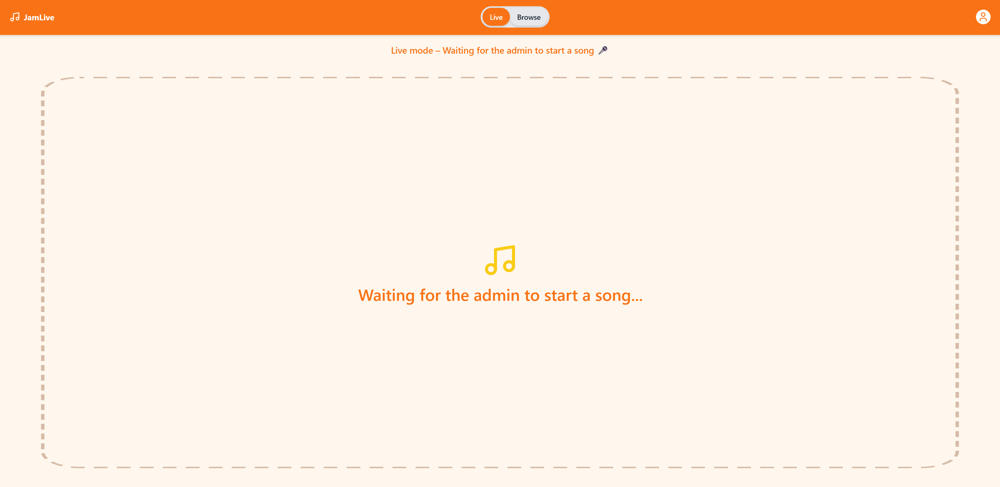
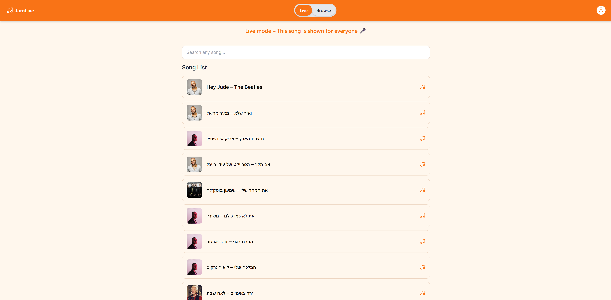
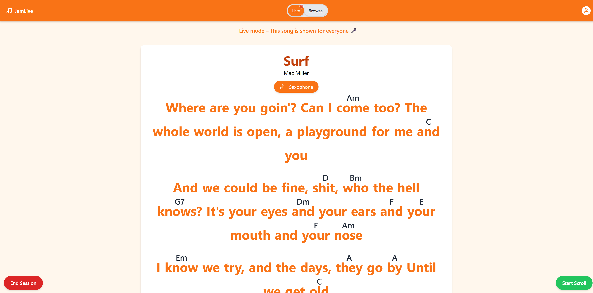
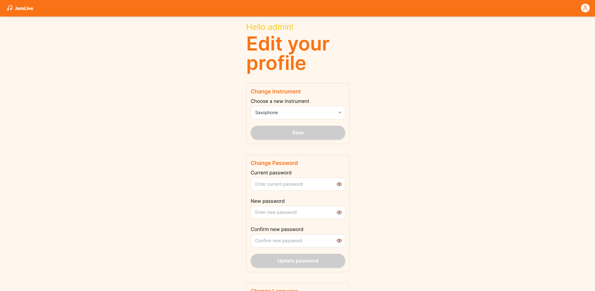

# 🎸 JamLive – Real-Time Rehearsal Web App

JamLive is a full-stack web application that enables musicians to join live rehearsal sessions directly from their mobile phones. Users register with their instrument, and an admin leads the session by selecting a song. Lyrics and chords are displayed in real time, with role-based views and synchronized scrolling.

## 🌐 Live Demo

- **Frontend**: [https://jamlive.vercel.app/](https://jamlive.vercel.app/)
- **Backend**: [https://dashboard.render.com/](https://dashboard.render.com/)

## 🚪 Signup Routes

| Role  | Path               | Notes                           |
| ----- | ------------------ | ------------------------------- |
| Admin | `/user-management` | Promoting a user to admin level |
| User  | `/register`        | Registers a regular user        |

## 👤 Test Users

| Role  | Username | Password |
| ----- | -------- | -------- |
| Admin | `admin`  | `admin`  |
| User  | `user`   | `user`   |

## 🧠 Features

- **Authentication**: Signup & login with role-based redirection.
- **Live Song Session**
  - Admin selects a song → triggers session start.
  - Users see a visual indicator that a live session is available.
  - Chords + lyrics for players, lyrics-only for singers.
- **Late-Join Sync**: Users who join mid-session instantly receive the current song + scroll position.
- **Auto Scroll**: Toggle smooth scrolling of lyrics.
- **View-Mode Persist**: Global `viewMode` (`browse` / `live`) is saved with Redux Persist, so navigation never “forgets” your state.
- **User Profile**
  - Edit instrument.
  - Change password (current + new × 2).
  - Delete account with confirmation.
- **RTL Support**: Full right-to-left layout and icon mirroring whenever the UI language is Hebrew.
- **Unified Session Manager**: Single hook (`useSessionManager`) drives all live-session events for Admin & User lobbies.
- **Socket.io**: Real-time sync between admin and connected users (plus auto-reconnect).
- **Accessibility**: Large fonts, high contrast for low-light rehearsal spaces.
- **Responsive**: Mobile-first design with Tailwind.
- **Conventional Commits**: Commitlint + Husky enforce `feat/fix/chore…` style messages for a clean Git history.

## 🧭 Lobby Modes & User Flow

Once logged in, users are redirected to their **respective lobby**:

- 👤 **Regular Users** → `/user-lobby`
- 🛠️ **Admins** → `/admin-lobby`

Each lobby supports two main view modes:

| Mode     | Description                                                                |
| -------- | -------------------------------------------------------------------------- |
| `browse` | Default state — users can freely search songs and explore the catalog.     |
| `live`   | Active session — all users view the same song, synchronized via WebSocket. |

### 👤 User Lobby (`/user-lobby`)

- In **`browse` mode**, users can freely search and preview songs from the catalog.
- When an admin starts a live session, users see a **subtle visual indicator** (a red dot above the “Live” label) showing that a session is in progress.
- Users can choose to enter the live session at any time. If they join mid-song, they receive the current song and scroll state instantly.

### 🛠️ Admin Lobby (`/admin-lobby`)

- Admins can search the song catalog and start a live session manually.
- Once started, all connected users receive the live indicator and can choose whether or not to join.
- Admins view a full live preview of the broadcasting song and can end the session at any time.

> 🧠 The current mode (`viewMode`) is saved globally using Redux Persist, so users stay in context even after navigating away from the lobby or refreshing.

## 🧪 Tech Stack

| Layer      | Tech                    |
| ---------- | ----------------------- |
| Frontend   | React + TypeScript      |
| Styling    | TailwindCSS             |
| State      | Redux Toolkit + Persist |
| i18n       | react-i18next           |
| Backend    | NestJS + Socket.io      |
| Containers | Docker (backend only)   |
| DB         | MongoDB (via Mongoose)  |
| Auth       | JWT                     |
| Hosting    | Vercel + Railway        |

## 🛠️ Local Setup

1. **Clone the repository**

```bash
git clone https://github.com/your-username/JamLive.git
cd JamLive
```

2. **Frontend setup**

```bash
cd frontend
npm install
npm run dev
```

3. **Backend setup**

```bash
cd backend
npm install
npm run start:dev
```

## 4. **Environment Variables**

You need to configure two `.env` files — one for the **frontend** and one for the **backend**:

### ✅ Frontend (`frontend/.env`)

```env
REACT_APP_BASE_URL=http://localhost:8000
REACT_APP_SOCKET_URL=http://localhost:8000
```

This sets the base URL for API requests during development.

---

### ✅ Backend (`backend/.env`)

```env
PORT=8000
MONGO_URI=<your MongoDB connection string>
JWT_SECRET=<your JWT secret>
JWT_EXPIRES_IN=90d
JWT_COOKIE_EXPIRES_IN=90
FRONTEND_ORIGIN=http://localhost:3000
```

- `MONGO_URI`: Connection string to your MongoDB instance (Atlas or local)
- `JWT_SECRET`: A secure string used to sign JWT tokens
- `FRONTEND_ORIGIN`: The URL of your frontend app (used for CORS)

> 💡 **Note**: The deployed demo version already connects to a live backend.  
> If you'd like to run the backend locally, you'll need to provide your own `MONGO_URI` and `JWT_SECRET`.

## 📬 Postman Collection

You can test the backend API using the Postman collection provided in this repository:

👉 [Download JamLive.postman_collection.json](./postman/JamLive.postman_collection.json)

The collection includes all available endpoints:

- Signup
- Login
- Song search
- Auth-protected routes

> Make sure to set the `url` environment variable in Postman to match your local or deployed backend (e.g., `http://localhost:8000` or `https://jamlive-api.up.railway.app`).

## 📸 Screenshots

### 🔐 Register Page


### 🔑 Login Page


### ⏳ User Lobby: Waiting Mode



### 🔍 Admin Lobby: Search Songs



### 🔍 Admin Lobby: Live Session



### 🎼 Profile



## 📎 Notes

- All connected users sync via WebSocket using Socket.io.
- Players who join **after** the session has started will still receive the current song automatically.
- The current song database is hard-coded in JSON format.

> Built with ❤️ by Segev Grotas · [LinkedIn](https://www.linkedin.com/in/segevgrotas/)
